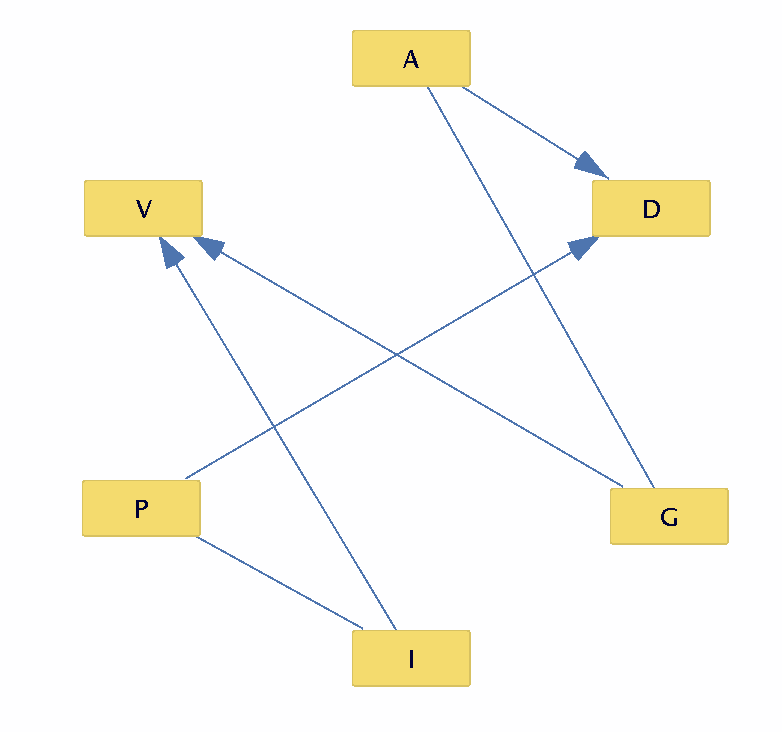
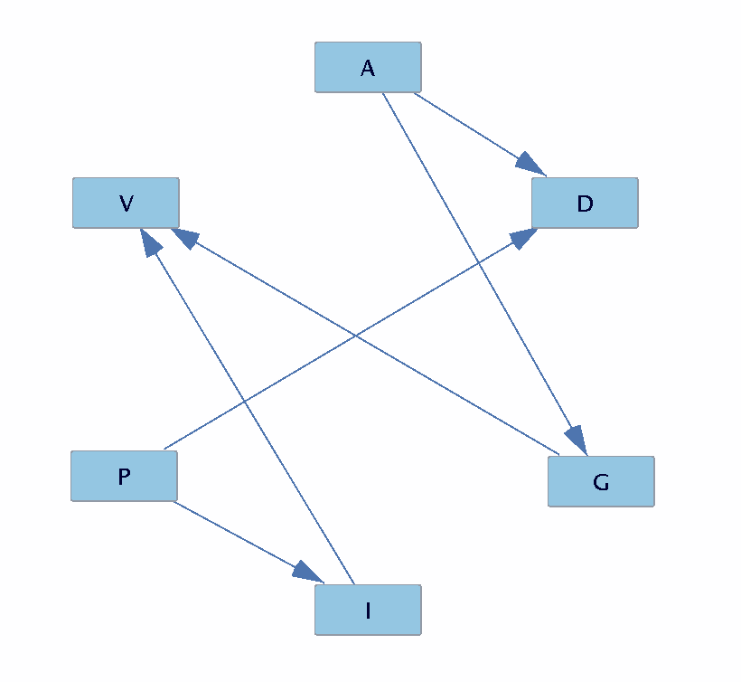

## I. Bayesian Network Modeling

#### Step 1: Learning Bayesian Network Structure

#### Original Graph:

#### Directed Graph

#### 1. Explain, using the theory behind BN structures, why the search algorithm was able to orient some edges but not others. Reference the graph you                  found above.

The search algorithm was not able to direct those edges for which there no difference was produces from either choice of directionality. This happens whenever no sink is either created or destroy in the process of directing the edge, as was the case only for connections `A-C` and `P-I`

#### 2. Explain your choices for network structure that you made above -- why did you orient the ambiguous edges the way that you did?

My choices where based on common sense (and knowledge - experience - of reality). I assume that somebodies political inclination is a factor that determines its opinion on matters of immigration, and likewise that age is a factor that has an influence on what someone thinks about gun control (and not the other way around)

### Step 2: Making Inferences

#### **First**, determine who is currently charted to win the congressional seat and by what margin.

My opponent is currently charted to win the congressional seat by a margin of roughly `25%`

#### **Second**, for each of the following, (a) compute the probability requested and then (b) determine whether or not the outreach team should target the individual for canvassing, and (c) record their values in your report.

| Request                      | Probability                | Winner   | Target? |
| ---------------------------- | -------------------------- | -------- | ------- |
| `P(V | A=1)`                 | {'1': 0.3565, '0': 0.6435} | Opponent | T       |
| `P(V | G=0)`                 | {'1': 0.3125, '0': 0.6875} | Opponent | T       |
| `P(V | G=0,I=0)`             | {'1': 0.6999, '0': 0.3000} | Me       | F       |
| `P(V | I=0,G=1)`             | {'1': 0.5, '0': 0.5}       | Tied     | T       |
| `P(V | A=0,P=1,I=0,D=0,G=0)` | {'1': 0.6999, '0': 0.3000} | Me       | F       |
| `P(V | A=0,P=1,I=1,D=1,G=0)` | {'1': 0.2000, '0': 0.7999} | Opponent | T       |
| `P(V | A=1,P=0,I=0,D=0,G=1)` | {'1': 0.5, '0': 0.5}       | Tied     | T       |

#### In a small paragraph, argue for whether or not you believe this practice should be considered ethical, especially if each individual's characteristics were collected via social media. Compare this practice to targeted consumerist advertising wherein ads are curated based on perceived interests.

Even though this has been a source of debate over the last few months, especially considering the Facebooks case, and it possible influence in the result of the last campaign, I do not see why this practice should be considered unethical. It is the main purpose of an add to sell a product, and its value comes from people being affected (or impressed) by them. It is thus key if we expect to continue to enjoy free technology (like facebook) that this add work, or else this source of revenue for software companies could never work. I also believe that the extent at which this influence is actually real (in particular for elections) is largely unknown, and it would seem plausible that it be in russias interest to have us think that their influence is so massive as to be able to change the outcome of an election, even when that might not be true. In other words, we would be having this same discussion regardless of the outcome of the election.

## II. Naive Bayes Classification (NBC)

#### Use the NBC to estimate each of the following classification queries, and record their values in your report:

| Request                      | Probability              | Winner   | Target? |
| ---------------------------- | ------------------------ | -------- | ------- |
| `P(V | A=0,P=1,I=0,D=0,G=0)` | [0.46720151, 0.53279849] | Me       | F       |
| `P(V | A=0,P=1,I=1,D=1,G=0)` | [0.73911226, 0.26088774] | Opponent | T       |
| `P(V | A=1,P=0,I=0,D=0,G=1)` | [0.36620794 0.63379206]  | Me       | F       |

#### Between your BN and NBC, did any of your queries return different probability values? If so, explain why this difference is witnessed, and answer: which one will be more accurate for inference queries?

| BN   | NBC        |
| ---- | ---------- |
|      | 0.46720151 |
|      | 0.73911226 |
|      | 0.36620794 |

All queries gave different probabilitie values, though the last query is very similar for both. The reason for this is explained bellow.

BN creates a better model in comparison to reality, hence it is more accurate.  NBC is called "naive" because it assumes independence on all features, hence less accurate. Furthermore, on NBC we label one variable the class variable, and all the rest are childrens of it. As a consequence  queries are really limited around that interpretation. Because of these two reasons, we see different probability values for our two models when tested on the same queries. Its important to mention that even though NBC is less accurate for inference queries it still succeeds in classifying and works good for smaller datasets.

#### Are there some queries that your BN can answer out-of-the-box, once constructed, that your NBC cannot? If so, explain why this is the case and then list 3 such queries.

Some examples of out-of-the-box answerable queries are: `P(A=1)`, `P(I=1)`and`P(D=1|P=1, A=1)`

(Basically all queries that do not involve wanting to know something about V (the class variable)).

This is because NBC  is not meant to answer general inference queries except those that pertain to classification.

#### Between your BN and NBC, did any of your queries (despite possibly different probability values) provide a different determination for an individual's predicted voting predilection (V)? For example, did your BN say an individual with some features would vote for your opponent, but your NBC said that same individual would vote for your candidate? If there are differences, answer: which one should you follow if you want to maximize your canvassing efficacy? Provide some proof from the data to back up this claim, assuming that the data is representative of your congressional district.

No, they all agree on the determination of it. However, if you see BN Has "stronger" probability values. What I mean by this is that if you look at the first query for example where we want to calculate `P(V | A=0,P=1,I=0,D=0,G=0)`, BN tells us that the I win with a probability of roughly `70%` wereas NBC tells us that I win with a probability of roughly `53%`, hence NBC has a "stronger" opinion on the decition target/not target. If we look at the data and look for the values that satisfy the query above (that is, `A=0,P=1,I=0,D=0,G=0` ) we get that roughly `70%` of the values on the data that match these queries had a value of `V=1`, this means that NB result allingns with the values on our dataset

**query 1**

1: 303 ->  `70%`

0: 131 -> `30%`

**query 2**

1: 825 -> `20%`

0: 3372 -> `80%`

**query 3**

1: 965 -> `50%`

0: 969 -> `50%`

1. ###### In a paragraph, make a comparative argument for the pros and cons of BNs vs. NBCs on both inference and classification tasks.

   Look at answer one, I basically say it there.

   In summary:

   NBC Pros:

   * Good for classification
   * Good for small dataset

   NBC Cons:

   * Because it is modeled as: 1 variable being parent of all the rest, this makes it very limited to represent reality
   * Assumes independence between all features which might not be true in reality hence give worst results for inference queries
   * Fail to perform general inference tasks (can only make inference on probabilities regarding the class variable)

   NB Pros:

   * Necessary to perform general inference tasks
   * Accurate probability values for inference queries when the model you input to NB is accurate.

   NB Cons:

   * Depends a lot on the model that you input and not on the data itself.

If you use a top down approach to BN structure (know all relationships between the variables and ahead of time) then its a good model, however if you don't know the model a priori, then NBC is better because it still succeeds in classifying the queries correctly and it depends on the data solely (and as I mentioned before it is good for small datasets).